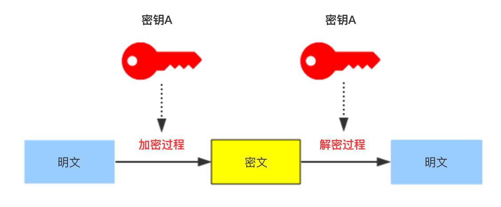
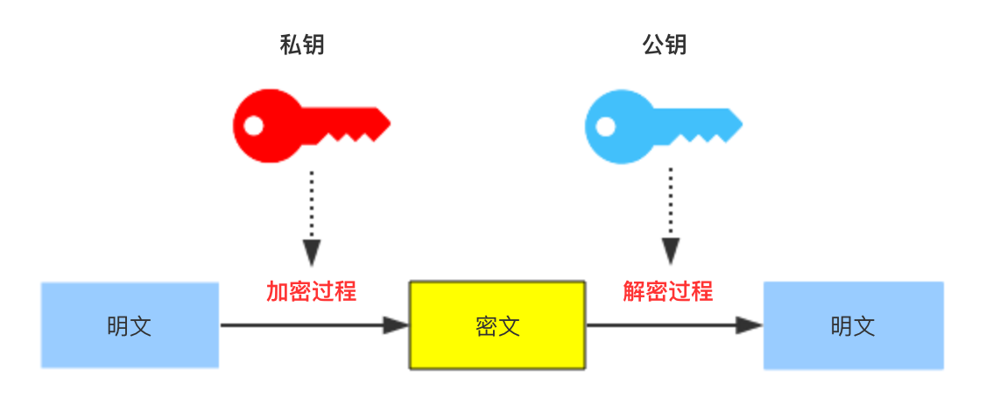
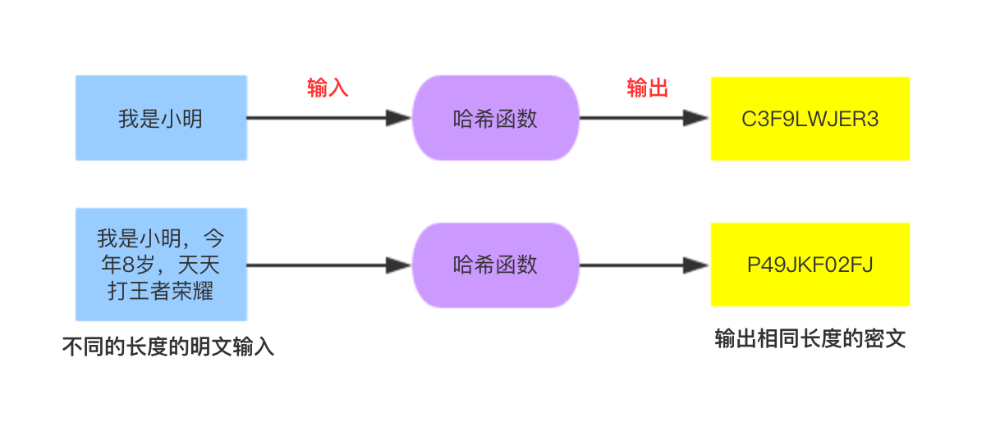

在开发过程中，常常用到各种加密方法和算法，本文总结了几种常用加密方法的原理。

---

## 对称加密

##### 原理：
加密和解密数据使用同一个密钥，适合对大量数据进行加解密
##### 安全性：
关键是密钥的保存方式，加密或是解密的任何一方泄漏密钥，都会导致信息泄漏
##### 代表算法：
DES、3DES、Blowfish、IDEA、RC4、RC5、RC6、AES等
##### 对称密码常用的数学运算：
> * **移位和循环移位**  
> 　　移位就是将一段数码按照规定的位数整体性地左移或右移。循环右移就是当右移时，把数码的最后的位移到数码的最前头，循环左移正相反。例如，对十进制数码12345678循环右移1位（十进制位）的结果为81234567，而循环左移1位的结果则为23456781。
> * **置换**  
> 　　就是将数码中的某一位的值根据置换表的规定，用另一位代替。它不像移位操作那样整齐有序，看上去杂乱无章。这正是加密所需,被经常应用。
> * **扩展**  
> 　　就是将一段数码扩展成比原来位数更长的数码。扩展方法有多种,例如,可以用置换的方法，以扩展置换表来规定扩展后的数码每一位的替代值。
> * **压缩**  
> 　　就是将一段数码压缩成比原来位数更短的数码。压缩方法有多种，例如，也可以用置换的方法，以表来规定压缩后的数码每一位的替代值。
> * **异或**  
> 　　这是一种二进制布尔代数运算。异或的数学符号为⊕ ，它的运算法则如下：  
> 1⊕1 = 0  
> 0⊕0 = 0  
> 1⊕0 = 1  
> 0⊕1 = 1  
> 　　也可以简单地理解为，参与异或运算的两数位如相等，则结果为0，不等则为1。
> * **迭代**  
> 　　迭代就是多次重复相同的运算，这在密码算法中经常使用，以使得形成的密文更加难以破解。

## 非对称加密

##### 原理：
非对称加密算法需要两个密钥：公开密钥（publickey）和私有密钥（privatekey）。公开密钥与私有密钥是一对，如果用公开密钥对数据进行加密，只有用对应的私有密钥才能解密；如果用私有密钥对数据进行加密，那么只有用对应的公开密钥才能解密
##### 安全性：
公钥可以被任何人知道，但是私钥被泄漏就会导致信息泄漏
##### 应用场景：
数字签名，私钥拥有者对信息进行加密，接受者使用公钥解密成功，就可以确定发送者的身份
##### 密钥长度：
通常是1024，2048等。密钥长度增长一倍，公钥操作所需时间增加约4倍，私钥操作所需时间增加约8倍，公私钥生成时间约增长16倍
##### 加密的明文长度：
加密的明文长度不能超过RSA密钥的长度减去11byte，比如密钥长度是1024位的，1024位=1024bit=128byte，128-11=117byte，所以明文长度不能超过117byte，如果长度超过该值将会抛出异常。加密后密文的长度为密钥的长度，如密钥长度为1024bit(128Byte)，最后生成的密文固定为 1024bit(128Byte)
##### 代表算法：
DES、3DES、Blowfish、IDEA、RC4、RC5、RC6、AES等

## 散列加密

##### 原理：
采用某种散列函数，输入不同长度的明文，得到相同的长度的密文，明文的微小变化都能引起密文的巨大变化。其实散列加密不算是真正的加密，而是生成对应明文的指纹信息，用来校验数据的完整性。
##### 安全性：
不能通过密文反推明文，通常作为数据的完整性校验
##### 应用场景1：
生成信息摘要，验证信息的完整性
##### 应用场景2：
不用明文存储用户密码，比如使用md5(md5(用户密码)+salt)来存储密码和验证密码，防止攻击者用彩虹表攻击 
##### 代表算法：
MD2、MD4、MD5、PANAMA、SHA-0、SHA-1、SHA-256、SHA-512等

## 各种算法对比和说明

|    名称    | 密钥长度 | 运算速度 | 安全性 | 资源消耗 |加密类型 |
| ---------- | ---    |---     |---     | --- | --- |
| DES |  56位 |	较快 |	低 | 中 |	对称 |
| 3DES | 168位 | 慢| 中 | 高 |  对称 |
| IDEA | 128位 | 较慢| 中 | 高 |	 对称 |
| AES | 128、192、256位 | 快 | 高 |  低 |	对称 |
| RSA |  | 慢 | 高 |  高 |	非对称 |
| DSA |  | 慢 | 高 |  低 |	 非对称 |
| ECC |  | 快 | 高 |  低 | 非对称 |
| SHA-1 |  | 慢 | 高 |  低 | 散列 |
| MD5 |  | 快 | 中 |  低 |散列 |

### DES 对称加密
> Data Encryption Standard（数据加密标准，又美国国密局，1972年美国IBM公司研制的对称密码体制加密算法，其密钥长度为56位。明文按64位进行分组，将分组后的明文组和56位的密钥按位替代或交换的方法变为64位的密文输出。

DES算法的入口参数有三个：Key、Data、Mode。 
> 　　其中`Key`为8个字节共64位，去除64位密码中作为奇偶校验位的第8、16、24、32、40、48、56、64位,剩下的56位作为有效输入密钥，是DES算法的工作密钥； 
> 　　`Data`也为8个字节64位，是要被加密或被解密的数据； 
> 　　`Mode`为DES的工作方式，有两种：加密或解密。 

DES算法是这样工作的：
> 　　如Mode为加密，则用Key 去把数据Data进行加密， 生成Data的密文形式（64位）作为DES的输出结果； 
> 　　如Mode为解密，则用Key去把密码形式的数据Data解密，还原为Data的明文形式（64位）作为DES的输出结果。

-
### 参考：
* [DES加密算法原理](https://www.jianshu.com/p/c44a8a1b7c38)
* [DES算法实例详解](http://www.hankcs.com/security/des-algorithm-illustrated.html)
* [AES对称加密算法扫盲](https://blog.csdn.net/jinxin_cuit/article/details/72626429)
* [DES，3DES,AES这三种对称密钥的区别与联系](http://www.cnblogs.com/ttss/p/4279757.html)
* [数字签名算法介绍和区别](https://zhuanlan.zhihu.com/p/33195438)